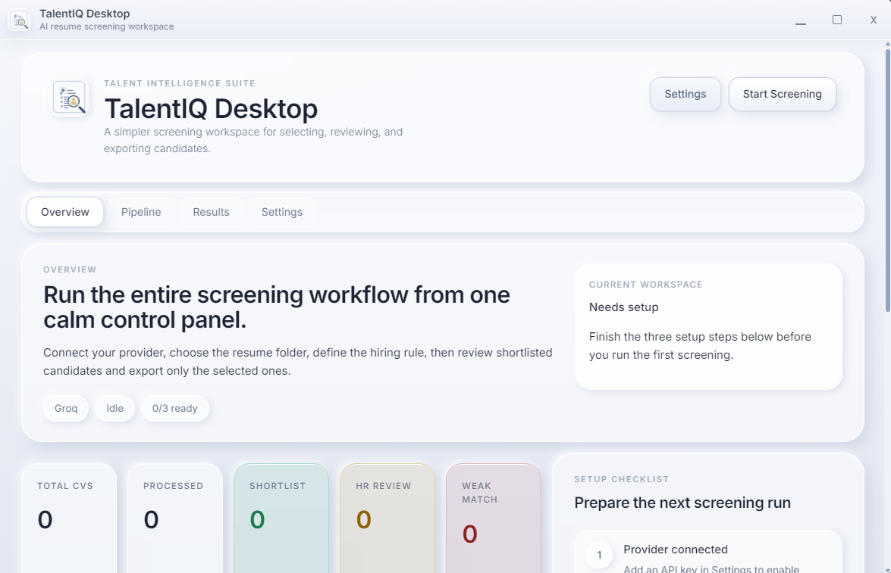
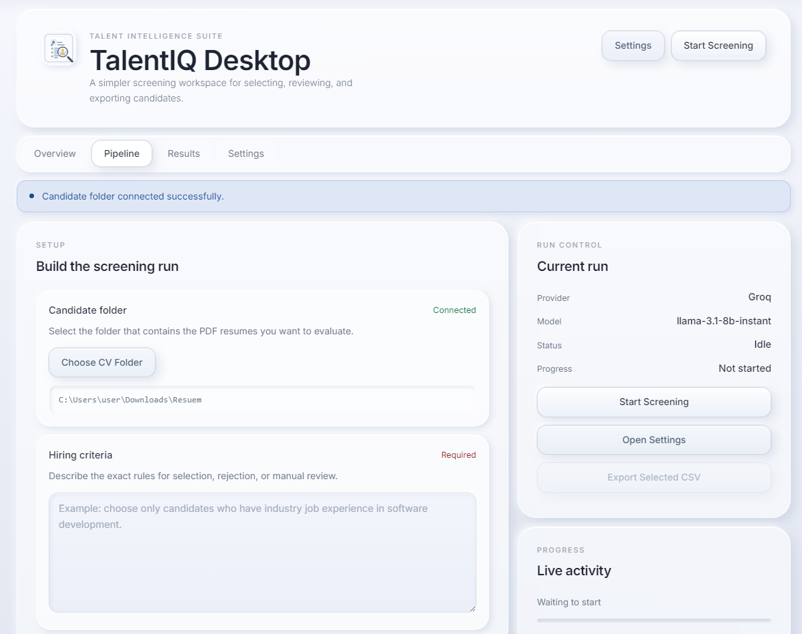
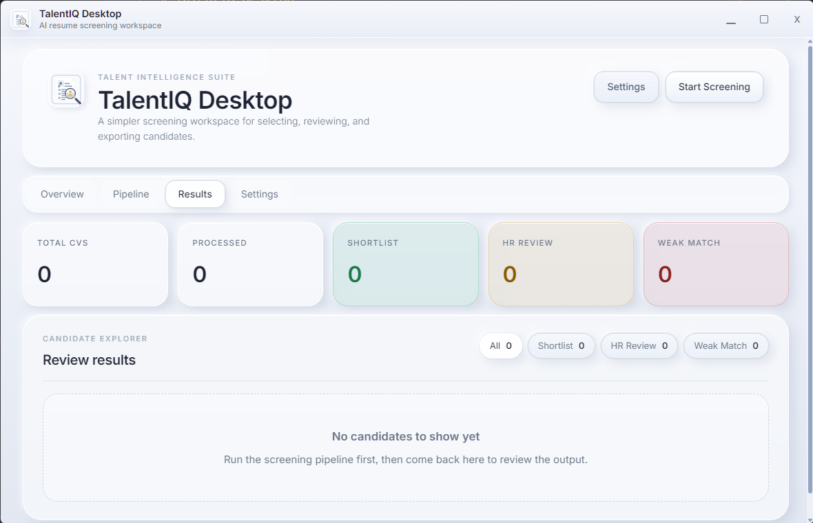
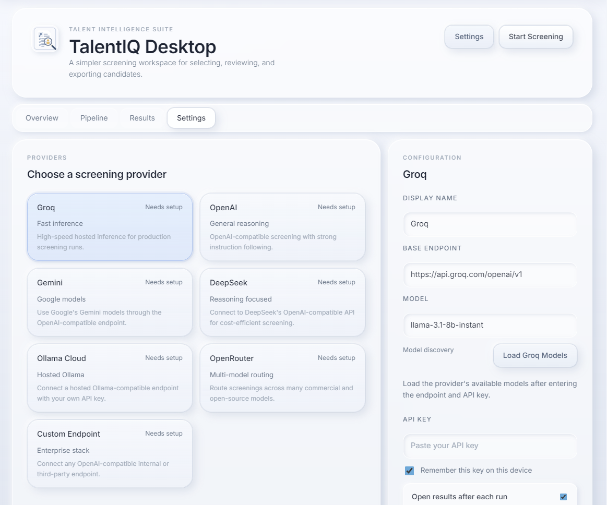

# TalentIQ Desktop

TalentIQ Desktop is a desktop application for AI-assisted resume screening. It helps teams review PDF CVs, apply a configurable hiring prompt, inspect categorized results, preview original resumes, and export shortlisted contacts.

Built with Tauri, React, TypeScript, and Rust, the app is designed for a smooth local desktop workflow rather than a browser-only tool.

## Overview

TalentIQ Desktop supports a complete screening flow inside one app:

- connect an LLM provider
- load available models
- select a folder of PDF resumes
- define candidate selection criteria
- review `Shortlist`, `HR Review`, and `Weak Match` results
- preview the original CV file
- export selected candidates to CSV

## Screenshots

Store screenshots in `docs/screenshots/` using the filenames below and GitHub will render them automatically.

### Overview


### Pipeline


### Results


### Settings


## Key Features

- Desktop application with a polished custom window chrome
- PDF resume screening from a local folder
- Configurable provider profiles from the UI
- Model discovery for supported providers
- Candidate result buckets for faster review
- CV preview in the system PDF viewer
- Reveal-in-folder support from the results list
- CSV export containing only `name` and `email`

## Supported Providers

TalentIQ Desktop currently includes presets for:

- `Groq`
- `OpenAI`
- `Gemini`
- `DeepSeek`
- `Ollama Cloud`
- `OpenRouter`
- `Custom Endpoint`

Most providers use OpenAI-compatible APIs. `Ollama Cloud` is handled with its provider-specific API flow.

## Tech Stack

- `Tauri 2`
- `React 19`
- `TypeScript`
- `Vite`
- `Rust`
- `reqwest`
- `pdf-extract`

## Project Structure

```text
src/
  components/     Reusable UI components
  config/         Provider presets and application constants
  sections/       Main application views
  types/          Shared frontend types
  utils/          Frontend helpers
  App.tsx         Frontend app coordinator

src-tauri/src/
  commands/       Tauri commands exposed to the frontend
  screening/      Resume screening and provider request logic
  models.rs       Shared Rust data models
  lib.rs          Tauri application wiring
  main.rs         Desktop entry point
```

## Getting Started

### Prerequisites

Make sure the following are installed:

- Node.js
- npm
- Rust toolchain
- Tauri platform prerequisites for your operating system

On Windows, that generally means the Rust MSVC toolchain and the required native build tools for Tauri.

### Install dependencies

```bash
npm install
```

### Run in development

```bash
npm run tauri dev
```

The development app uses the Vite dev server on `http://localhost:3000`.

## Building the Desktop App

Create a production build with:

```bash
npm run tauri build
```

On Windows, the generated installer is typically located in:

```text
src-tauri/target/release/bundle/nsis/
```

This output can be shared as a standard Windows installer.

## Provider Configuration

### OpenAI, Groq, Gemini, DeepSeek, OpenRouter

- enter the API key in `Settings`
- choose a model manually or load available models
- confirm the base endpoint if you use a custom gateway

### Ollama Cloud

- enter your Ollama Cloud API key
- keep the default base endpoint unless you are using another hosted compatible endpoint
- load available models from the app, then select one

### Custom Endpoint

Use the custom preset for internal gateways or any OpenAI-compatible API service.

## Export Format

CSV export currently includes:

- `name`
- `email`

This keeps exported output lightweight for recruiter follow-up workflows.

## Screenshot Setup

Place screenshots in:

```text
docs/screenshots/
```

Recommended filenames:

- `overview.png`
- `pipeline.png`
- `results.png`
- `settings.png`

## Available Scripts

- `npm run dev` starts the Vite frontend
- `npm run build` builds the frontend
- `npm run preview` previews the built frontend
- `npm run tauri dev` runs the desktop app in development
- `npm run tauri build` creates a production desktop build

## Publishing to GitHub

If this project is not yet connected to a Git repository:

```bash
git init
git branch -M main
git add .
git commit -m "Initial commit"
git remote add origin https://github.com/YOUR_USERNAME/YOUR_REPO.git
git push -u origin main
```

## Notes

- The app expects resume files in PDF format.
- CV preview opens the file in the operating system's default PDF viewer.
- Screening quality depends on the selected model and the clarity of the hiring prompt.

## License

Add your preferred license before publishing the project publicly.
